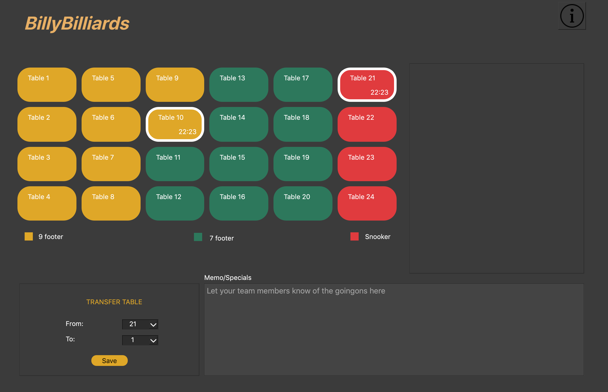
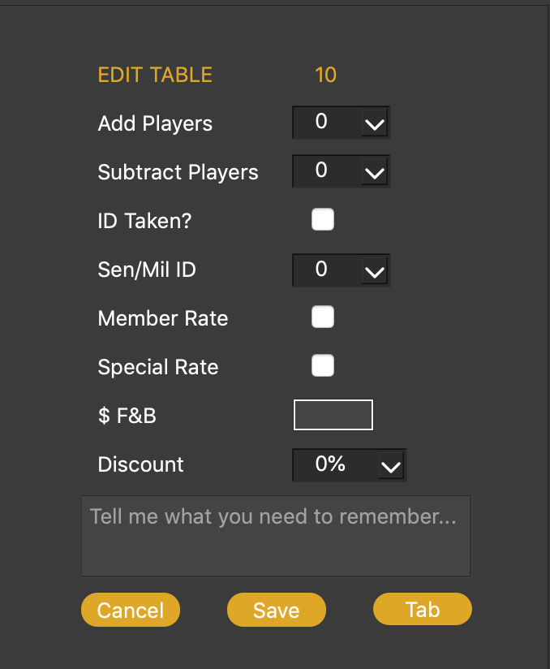
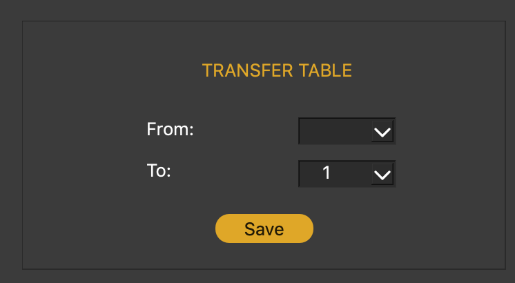
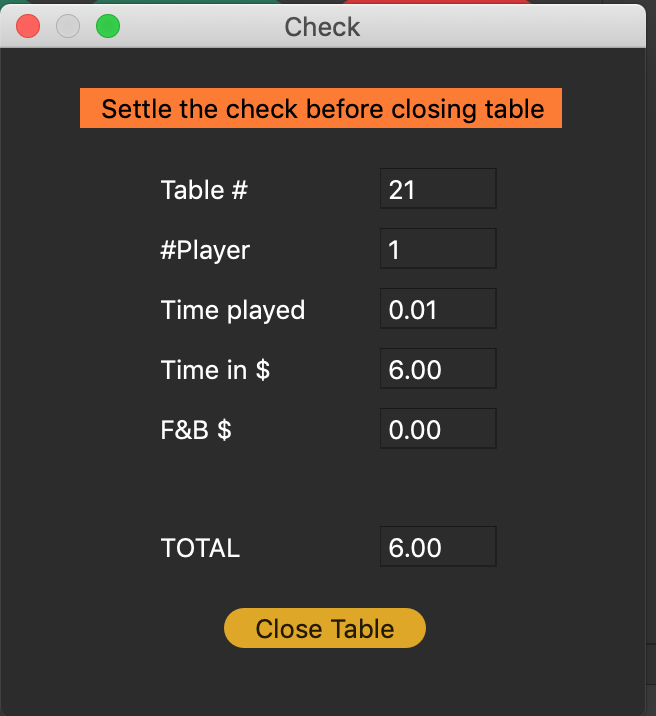

### Welcome to BillyBilliards
  This application is built as a POS used in a pool-table bar and restaurant, aiming to help the bar manager keep track of time customers spend in the bar and the services they use.
  
### Key features
1. Keeping track of pool table time.
2. Keeping track of food & beveraege consumption.
3. Applying different rates for different table types, player's member rates, promotions.
4. Transfer tables
5. Calculating customer's bills.
6. Daily revenue's summary.

### User Interfaces

There are 3 types of tables: 9 footer, 7 footer and Snooker. Each table uses different rates to calculate bills.

In Edit table section, cashiers can select number of players, discount options, add food/beverage consumptions to customers' bills.

You can transfer from a table to another. All information from the last table is transfered to the new one.

After a customer check out, the app pops up a message to show bill details and reminds the casier to return customers' IDs if neccessary.
  
### Framework 
  The project was built and tested in QT Creator version 10.14, 10.15, and initially built for Mac Desktop use.
### Mac Os Compatibility
  We haven't tested all Mac OS versions to figure out which versions are compatible with this app. However, we noticed that our released version woudn't work on Sierra and High Sierra. Our current Mac OS is Catalina.
